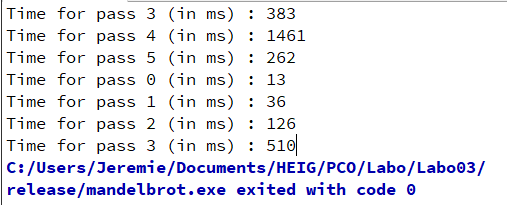

# PCO Labo03: Mandelbrot

##### Châtillon, Smith

Afin de réaliser ce laboratoire, nous avons dû extraire une partie du code de *RenderThread* dans une autre classe que nous avons céée (*DelegationThread*). Afin de pouvoir mulit-threader la tâche des calculs de l'affichage, il faut que tous les threads enfants appliquent le même code mais avec des variables differentes. Nous avons donc choisi de créer notre classe DelegationThread qui effectue les calculs pour une **partie de l'image**. Cette classe à pour but de calculer les pixels de l'image sur une proportion donnée (dans notre cas nous avons sépraré l'image en plusieurs sous-image avec sa hauteur initial).  Comme la division de la hauteur se fair avec un division entière, le dernier DelegationThread travaille avec un auteur un peu plus grande que les autres car on y ajoute le reste de la division (pour ne pas avoir de lignes noires à la fin de l'image). Tous les argument qui ne sont pas des types primitifs sont passé par pointeurs pour ne pas faire une copie inutile de ceux-ci. Attention, **seulement l'image peut et doit être modifiée**. Il fait que lire les autres arguments passés par pointeurs.

Ainsi, la méthode *run()* de la classe délégation thread contient seulement la boucle qui effectue le nombre de *passe*. Dans cette boule, à chaque passe, n DelegationTread (en fonction  du retour de *QThread::idealThreadCount()*)  sont instancié puis executé (*.run()*). Ils sont stoqués dans une liste. Une fois les DelegationTreads lancés, la boucle attends que ces threads aient terminé leur job (*.wait()*) et les supprime (*.delete()*). Une fois ces actions effecuées, la boucle recommence avec un nombre de *passe* plus grand. Le *RenderThread* n'effectue aucune action avant la terminaison de chacun de ses threads enfant.

Il est possible que l'utilisateur change, arrête l'execution du thread principal (redimentionnement de la fenêtre par exemple). Pour que les *DelegationTreads* ne continuent pas leur tâche, nous avons fait passer les variables *abort* et *restart* par pointeur pour que les threads n'executent pas des calculs inutils ou se términenent au moment voulu. 

Il n'est pas nécessaire d'implémenter un déstructeur spécifique dans la classe *DelegationTread*. Ceci est dû au fait que la fonction *RenderThread* attends la fin de l'execution de sa fonction run() avant de pouvoir être supprimée. Donc les *DelegationTreads* lancés à l'intérieurs seront aussi terminés correctement.

### Tests

Pour tester notre programme, nous avons verifié que l'image obtenue à l'execution était conforme et redimentionnable.

Nous avons aussi testé que le nombre de *passe* se réinitialise à chacunes des modifications de l'image (interruption des calculs).

Finalement, nous avons contrôlé que le multi-threading était bien actif en contrôlant l'état de chacun des coeurs de notre processeur pendant l'execution.
